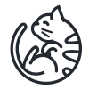

<div align="center">
  <picture>
    <source media="(prefers-color-scheme: dark)" srcset="./docs/assets/gitty-cat-dark-mode.svg">
    <source media="(prefers-color-scheme: light)" srcset="./docs/assets/gitty-cat-light-mode.svg">
    
  </picture>
</div>

# Gitty

A Bun + OpenTUI review workspace for local git changes and GitHub pull requests. Gitty shows working tree, staged, patch, and stdin diffs, and can also browse open GitHub PRs from your repositories with discussion, metadata, and diff views.

It is built with [`hunkdiff/opentui`](https://www.npmjs.com/package/hunkdiff) components and inspired by [Hunk](https://github.com/modem-dev/hunk).

## Local Development

```bash
bun install
bun run start
bun run check
```

Run `bun run check` before opening a PR; it typechecks the app and runs the Bun test suite.

With no input, Gitty opens the current repository. The `Working changes` view shows the current `git diff` plus untracked files when changes exist. If the repo is clean, the repository opens with an empty Working changes view.

You can add multiple git repositories, pass a patch file, read from stdin, or view staged changes:

```bash
gitty path/to/change.patch
gitty --repository ../repo-a --repository ../repo-b
git diff | gitty
gitty --staged
```

For GitHub repositories, Gitty uses the GitHub CLI when available to list open PRs authored by you and PRs requesting your review. Selecting a PR opens a review view with Discussion and Diff tabs, rendered PR description Markdown, status checks, review state, reviewers, assignees, labels, and unresolved comment count.

Inside the TUI:

- `o` opens another git repository by path. Relative paths and `~` are supported.
- In the open repository dialog, use `Up`/`Down` to pick a directory and `Tab` to complete it.
- `t` opens the theme picker. Use `Up`/`Down` to preview themes, `Enter` to save, and `Esc` to cancel.
- `Tab` cycles repositories.
- Click any repository in the sidebar to switch to it.
- Click a PR in the sidebar to open its review view. Click the PR URL in the detail header to open it in your browser.
- Click the `Discussion` and `Diff` tabs in a PR view to switch between the rendered PR body and the pull request patch.
- Click the `x` beside a repository in the sidebar to close it.
- Line wrapping is always on.
- Status messages appear in a bottom-right overlay so command controls stay visible.
- The left sidebar lists repositories, each with a `Working changes` menu item.
- For GitHub repositories, the sidebar also lists open PRs split into `Your pr's` and `Needs your review`, with check-status dots and changes-requested notices.
- The git diff UI lives inside a swappable pane and always renders split diffs.
- `q`, `Esc`, or `Ctrl+C` exits.

Gitty defaults to Catppuccin Macchiato and includes built-in Hunk themes plus a common Ghostty-compatible theme catalog for the app shell and diff view. Theme picker choices are saved with workspace state, and you can still pass `--theme <name>` to override the saved theme for a run.

## Themes

Gitty supports the built-in Hunk themes and common Ghostty themes included in the theme picker. Ghostty themes use their native Ghostty palette values for both the surrounding app UI and the rendered diff, so a selected theme applies across the whole interface.

## Notes

This app uses [`hunkdiff/opentui`](https://www.npmjs.com/package/hunkdiff), which declares OpenTUI and React as peer dependencies. The installed OpenTUI package versions are aligned to Hunk's current peer range.

Gitty takes inspiration from [Hunk](https://github.com/modem-dev/hunk), the terminal diff review tool that publishes the reusable `hunkdiff` components.

PR sections use the GitHub CLI when available. Run `gh auth login` if the sidebar reports that PRs are unavailable.

## Attribution

Cat icon created by Dan Hetteix from [The Noun Project](https://thenounproject.com/).
